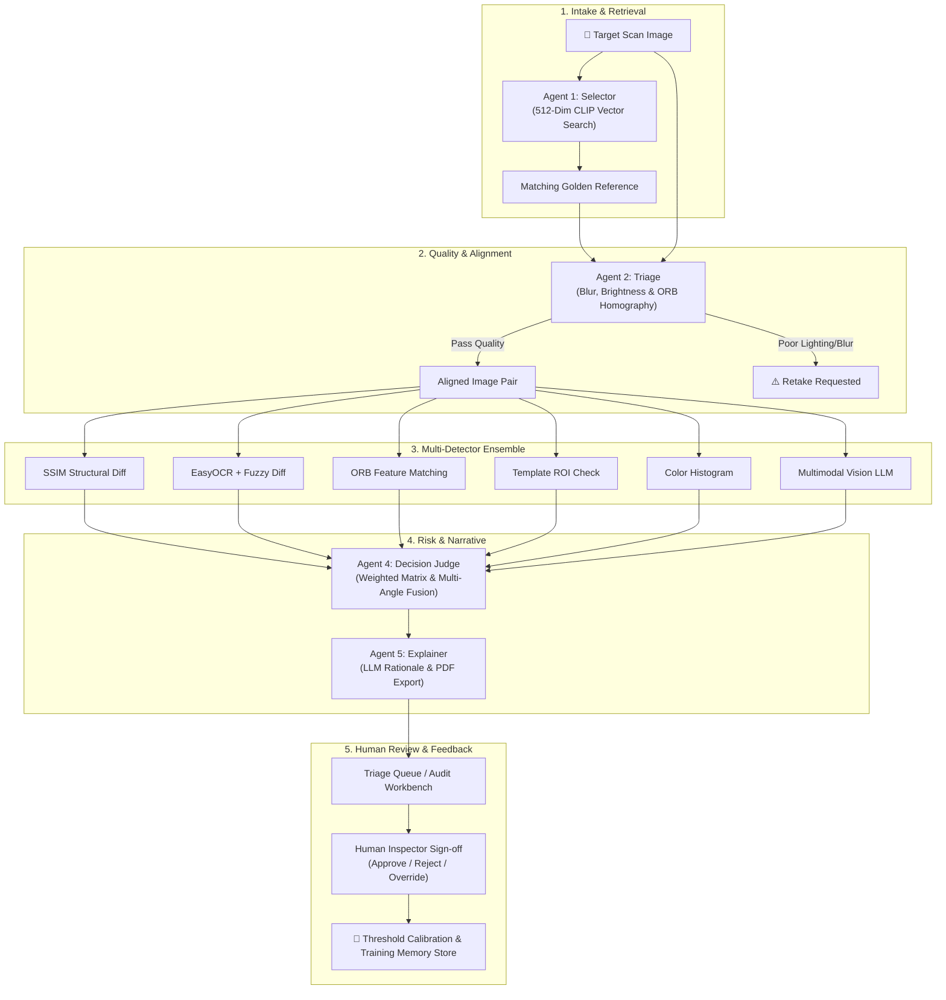
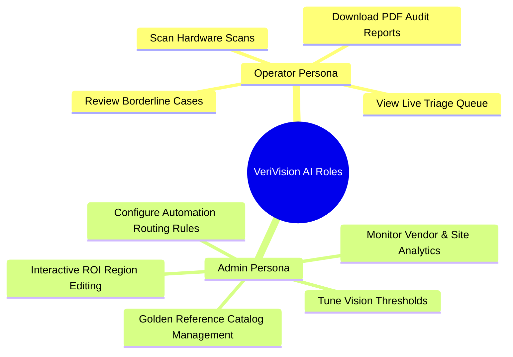
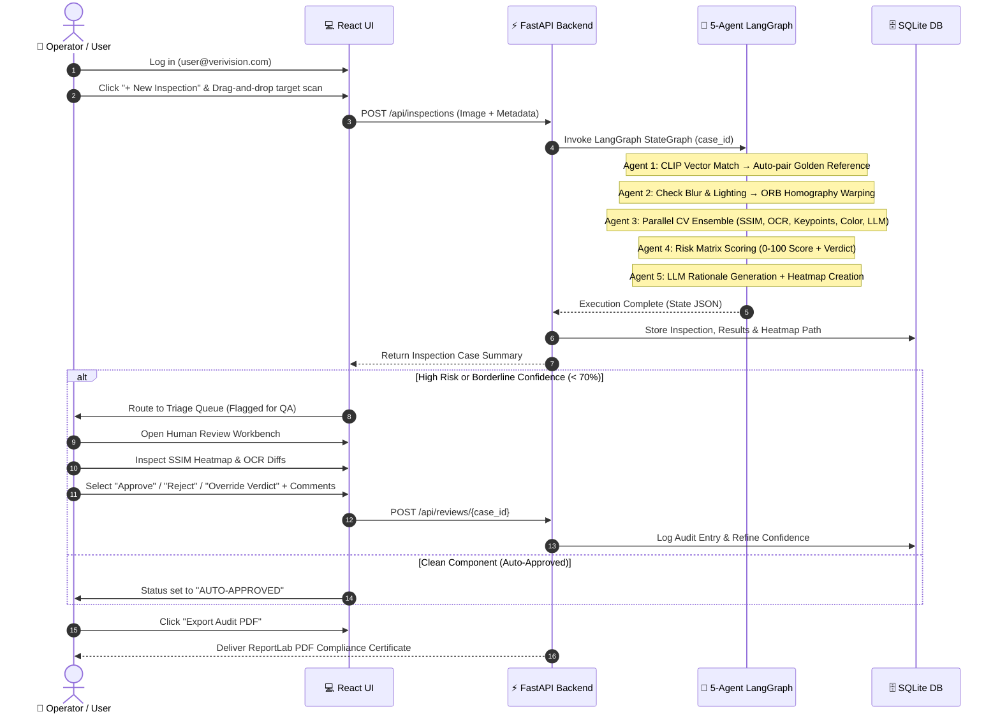
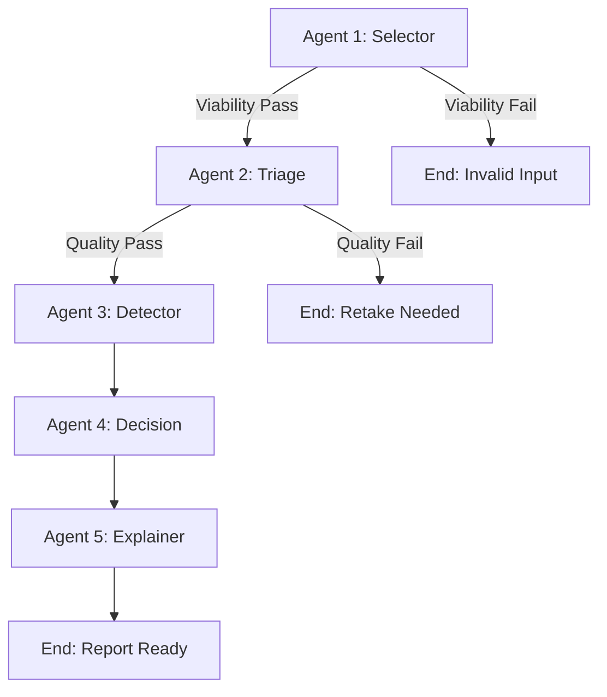
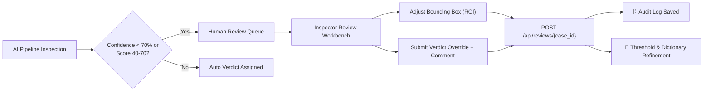

<p align="center">
  
  
  
</p>

<h1 align="center">🤖 VeriVision AI — Agentic Workflow, User Roles & Deep-Dive Architecture</h1>

<p align="center">
  <em>Comprehensive guide covering the 5-Agent Computer Vision pipeline, User vs. Admin workflows, PDF reporting, and Human-in-the-Loop (HITL) active learning loop.</em>
</p>

---

## 📑 Table of Contents
1. [🌐 High-Level Platform Overview](#-high-level-platform-overview)
2. [👥 User Roles: Operator vs. Admin Workspace](#-user-roles-operator-vs-admin-workspace)
3. [🚀 End-to-End User Demo Workflow](#-end-to-end-user-demo-workflow)
4. [🛠️ Deep Dive: The 5 LangGraph Agents](#️-deep-dive-the-5-langgraph-agents)
   - [Agent 1: Selector & Gatekeeper](#agent-1--product-selector--gatekeeper-agent_1_selectorpy)
   - [Agent 2: Triage & Aligner](#agent-2--triage--aligner-agent_2_triagepy)
   - [Agent 3: Vision-AI Anomaly Detector Ensemble](#agent-3--vision-ai-anomaly-detector-ensemble-agent_3_detectorpy)
   - [Agent 4: Decision & Fusion Judge](#agent-4--decision--fusion-judge-agent_4_decisionpy)
   - [Agent 5: Audit Explainer & Report Engine](#agent-5--audit-explainer--report-engine-agent_5_explainerpy)
5. [📄 Audit-Ready PDF & CSV Reporting System](#-audit-ready-pdf--csv-reporting-system)
6. [🧠 Human-in-the-Loop (HITL) Active Learning & Feedback Loop](#-human-in-the-loop-hitl-active-learning--feedback-loop)
7. [📊 Live Telemetry & Analytics Dashboard](#-live-telemetry--analytics-dashboard)

---

## 🌐 High-Level Platform Overview

**VeriVision AI** automates hardware quality assurance and return fraud detection across global repair centers and manufacturing lines. By replacing manual visual inspection with an autonomous **5-Agent Computer Vision pipeline**, VeriVision reduces inspection times from hours to milliseconds while capturing subtle fraud indicators like 0-to-O character alterations on serial stickers, missing QC tags, non-OEM replacement covers, and reused boards.



---

## 👥 User Roles: Operator vs. Admin Workspace

VeriVision AI implements strict **Role-Based Access Control (RBAC)** to serve two primary operational personas in technical logistics environments:



### 1. 👷 Operator Inspector (`user@verivision.com`)
*Target User: Line Engineers, Warehouse Technicians, QA Inspectors*
- **Primary Goal:** Rapidly verify incoming return parts, view AI findings, and process flagged items.
- **Access Scope:**
  - **AI Inspection Submission:** Upload part images via drag-and-drop, specify capture site, camera angle, vendor, and component batch.
  - **Live Triage Queue:** Filter assigned inspection items by status (`AUTO-APPROVED`, `PENDING QA`, `QUARANTINE`, `RETAKE REQUESTED`).
  - **Split-Panel Audit Workbench:** Inspect side-by-side golden vs target images, SSIM heatmaps, bounding box annotations, and OCR diffs.
  - **Human-in-the-Loop Review:** Approve AI verdicts or flag items for supervisor escalation.
  - **PDF Export:** Generate and download official laboratory inspection certificates.

### 2. 🔐 Admin Supervisor (`admin@verivision.com`)
*Target User: Quality Managers, Technical Directors, Supply Chain Analysts*
- **Primary Goal:** Calibrate AI detection sensitivity, manage catalog references, enforce compliance policies, and analyze vendor fraud trends.
- **Access Scope:**
  - **Full Operator Rights:** Access all operator submission, queue, and detail features across *all* operators and sites.
  - **Golden Reference Catalog Portal:** Upload new OEM master references, extract 512-dim visual embeddings, and set expected serial number patterns.
  - **Interactive ROI Canvas Editor:** Draw and adjust label bounding boxes (`label_roi`), logo templates (`template_roi`), and material inspection windows (`color_roi`).
  - **Admin Calibration Console:** Fine-tune live system thresholds in real-time:
    - *SSIM Sensitivity Threshold* (e.g., `0.85`)
    - *Keypoint Delta Allowance* (e.g., `15%`)
    - *OCR Fuzzy Match Strictness* (e.g., `100%`)
  - **Automation Policy Rules:** Define high-risk routing logic (e.g., *"If Commodity = Microchip → always route to manual QA"*).
  - **Vendor & Site Analytics Dashboard:** Track fraud frequency by vendor, capture site, component category, and monthly trend trajectory.

---

## 🚀 End-to-End User Demo Workflow

Here is the exact step-by-step walkthrough of how a user interacts with VeriVision AI during a live demo:



### Detailed Step Walkthrough:

1. **Session Login:** The user signs into the system using JWT-authenticated credentials.
2. **Scan Submission:** On the **AI Inspection Page**, the user uploads a hardware component image (e.g., a Dell laptop motherboard, DDR5 RAM stick, or M.2 SSD).
3. **Automated Vector Pairing:** User leaves part selection on `Auto-Detect (Vector Search)`. Agent 1 instantly calculates the image's visual embedding and pairs it with the correct OEM master catalog entry.
4. **Execution Telemetry:** The backend executes all 5 agents in parallel, returning full metrics and annotated heatmaps in under **3 to 5 seconds**.
5. **Interactive Evidence Audit:** The user opens the **Inspection Detail Workbench**:
   - **Visual Comparison Slider:** Compare golden vs target scan side-by-side.
   - **Thermal SSIM Overlay:** Toggle the JET heatmap highlighting missing capacitors or damaged traces in neon red.
   - **OCR Diff Table:** View expected serial numbers vs. detected text with exact character-level mismatch highlighting.
6. **Human Review & Feedback:** If the case falls into a borderline confidence range (40-70% score), the operator provides supervisor sign-off, adding audit notes that feed back into the learning loop.
7. **Report Download:** The operator clicks **Download PDF Report** to generate a laboratory audit document ready for vendor disputes.

---

## 🛠️ Deep Dive: The 5 LangGraph Agents

VeriVision AI’s intelligence is powered by a **5-Agent LangGraph State Machine** (`backend/app/agents/workflow.py`). Each agent acts as an autonomous node with specialized responsibilities:



---

### Agent 1 — Product Selector & Gatekeeper (`agent_1_selector.py`)

#### Primary Responsibility
Identifies the exact OEM part catalog model from an incoming scan and verifies image comparison viability before heavy computation begins.

#### Technical Highlights
- **512-Dimensional Vector Indexing:** Utilizes **Open_CLIP (ViT-B/32)** to extract a visual embedding vector. Performs Cosine Similarity search against indexed Golden References in `<10ms`.
- **Multimodal Commodity Classifier:** If API keys are active, calls OpenRouter multimodal vision models to auto-classify the hardware commodity (`motherboard`, `ram`, `storage`, `microchip`, `label`).
- **Viability Gatekeeper:**
  - Decodability check on disk
  - Aspect ratio orientation verification (prevents comparing portrait vs landscape)
  - Resolution scale difference checks (prevents comparing 200px thumbnails against 4K images)

```python
# Agent 1 State Output Example
{
  "commodity": "ram",
  "golden_path": "data/golden/dell_ddr5_ram.png",
  "source_reference_identical": False
}
```

---

### Agent 2 — Ingest & Triage Aligner (`agent_2_triage.py`)

#### Primary Responsibility
Evaluates camera clarity, lighting conditions, and performs geometric image registration so target scans align perfectly with golden references.

#### Technical Highlights
- **Blur Detection (Laplacian Variance):** Computes $\text{Var}(\nabla^2 I)$. If score $< 100.0$, flags as blurry and requests a re-scan.
- **Lighting Intensity Range:** Calculates mean pixel intensity $\mu$. Verifies brightness is within optimal bounds ($40 \le \mu \le 220$).
- **ORB Feature Homography Alignment:**
  - Extracts 2,000 ORB keypoints from both images
  - Matches descriptors using `BFMatcher(NORM_HAMMING)`
  - Calculates RANSAC Homography matrix $H$
  - Warps target scan to match golden reference dimensions
  - Enforces a minimum RANSAC inlier ratio ($\ge 15\%$) to prevent invalid warping distortions

---

### Agent 3 — Vision-AI Anomaly Detector Ensemble (`agent_3_detector.py`)

#### Primary Responsibility
Executes 6 independent computer vision and vision-LLM detection algorithms in **parallel** using Python `ThreadPoolExecutor`.

#### The 6 Parallel Detectors:

| Detector | Algorithm / Method | What It Detects | Key Metrics Returned |
|:---|:---|:---|:---|
| **1. SSIM Structural Diff** | `skimage.metrics.structural_similarity` | Component swaps, missing chips, burnt traces | `ssim_score` ($0.0 - 1.0$), `heatmap_img` |
| **2. EasyOCR & Character Diff** | EasyOCR + Levenshtein String Match | Altered serial numbers, missing labels | `ocr_similarity`, `ocr_mismatches` array |
| **3. ORB Keypoint Rate** | KNN Feature Descriptor Matching | Assembly variations, swapped boards | `keypoint_ratio` ($0.0 - 1.0$) |
| **4. Template ROI Presence** | `cv2.matchTemplate(TM_CCOEFF_NORMED)` | Missing QC stickers, warranty seals | `template_match_score`, `template_match_found` |
| **5. 3D Color Histogram** | RGB 16x16x16 Histogram Correlation | Non-OEM labels, paint/material hue shifts | `color_hist_similarity` ($0.0 - 1.0$) |
| **6. Multimodal Vision LLM** | OpenRouter Vision Model (`openrouter/free`) | Semantic defects (scratches, cracks, solder residue) | `multimodal_report` narrative text |

#### Visual Outputs Generated by Agent 3:
1. **SSIM Heatmap Overlay:** Generates glowing neon-red bounding box overlays on top of high-delta difference regions.
2. **Side-by-Side Diagnostic Card:** Merges Golden Standard, Target Scan, and Heatmap into a unified 3-panel card with headers.

---

### Agent 4 — Decision & Fusion Judge (`agent_4_decision.py`)

#### Primary Responsibility
Evaluates the outputs of all 6 detectors, applies calibrated business weights, and assigns a final fraud score, verdict category, and recommended action.

#### Mathematical Risk Scoring Formula
$$\text{Fraud Score} = \min\left(100, \, 1.5 \times \sum (W_i \times L_i)\right)$$

Where Loss $L_i = 1.0 - \text{Similarity}_i$, and weights are allocated as:
- **SSIM Structural Loss:** $35\%$
- **OCR Text Mismatch Loss:** $20\%$
- **CLIP Vector Embedding Loss:** $15\%$
- **Keypoint Descriptor Loss:** $15\%$
- **Template / Logo Loss:** $10\%$
- **Color Histogram Loss:** $5\%$

```mermaid
gantt
    title Decision Matrix Weight Allocations
    dateFormat X
    section Weights
    SSIM Structural Diff (35%) : active, 0, 35
    OCR Text Difference (20%) : crit, 35, 55
    CLIP Vector Search (15%) : 55, 70
    Keypoint Matching (15%) : 70, 85
    Template ROI Check (10%) : 85, 95
    Color Correlation (5%) : 95, 100
```



#### Verdict Hierarchy & Recommended Actions:
- 🟢 **Clean** $\rightarrow$ `Accept` (Score $0-24$)
- 🟡 **Reused** $\rightarrow$ `Request Vendor Verification` (Score $25-49$)
- 🟠 **Mismatched / Missing** $\rightarrow$ `Quarantine & Escalate` (Score $50-69$)
- 🔴 **Tampered** $\rightarrow$ `Quarantine & Escalate` (Score $70-100$)

#### Bonus Feature: Multi-Angle Fusion Engine
Combines evaluation scores from 2–3 camera views (e.g., Top 0°, Side 45°, Profile 90°) of the same part using **Noisy-OR Probabilistic Fusion**:
$$P(\text{Fraud}_{\text{fused}}) = 1 - \prod_{i=1}^{N} \left(1 - \frac{S_i}{100}\right)$$
Cross-angle evidence agreement boosts combined decision confidence by **+5% per agreeing view**.

---

### Agent 5 — Audit Explainer & Report Engine (`agent_5_explainer.py`)

#### Primary Responsibility
Translates complex mathematical metrics into audit-ready, fluent natural language narratives.

#### Implementation Architecture
- **Primary LLM Generation:** Sends metrics to OpenRouter LLM with strict grounding instructions: *"Write an official audit narrative. Do not contradict Agent 4's verdict or introduce unlisted numbers."*
- **Deterministic Local Template Fallback:** If offline or API fails, uses a multi-paragraph template generator that dynamically constructs explanation sections for SSIM, OCR, template presence, color correlation, and verdict rationale.

---

## 📄 Audit-Ready PDF & CSV Reporting System

VeriVision AI generates laboratory-grade PDF reports via **ReportLab** (`backend/app/services/reporting.py`).

### PDF Audit Certificate Contents:
1. **Document Header:** Company logo, document title, timestamp, case UUID.
2. **Metadata Grid:** Case ID, Part Code, Capture Site, Camera Angle, Inspector Email, Pipeline Version (`FraudSense v4.2`), Image Hash.
3. **Verdict Banner:** Color-coded verdict (`CLEAN`, `TAMPERED`, `MISSING`, `MISMATCHED`), Fraud Score (0-100), AI Confidence %, Recommended Action.
4. **Visual Evidence Triad:** Side-by-side display of **Golden Reference**, **Target Scan**, and **SSIM Anomaly Heatmap**.
5. **Detector Metrics Table:** SSIM index, keypoint match %, expected vs detected OCR string.
6. **OCR Character-Level Diff Grid:** Table mapping each string position, expected character, detected character, and match status (`MATCH` / `MISMATCH`).
7. **Supervisor Audit Log Trail:** Complete history of human reviews, including actor name, previous verdict, updated verdict, timestamp, and comments.

---

## 🧠 Human-in-the-Loop (HITL) Active Learning & Feedback Loop

The **Human Review Workbench** (`frontend/src/pages/HumanReviewPage.jsx`) bridges automated AI detection with human domain expertise:



### Key HITL Features:
1. **Low-Confidence Auto-Routing:** Any inspection with confidence $< 70\%$ or borderline score ($40-70$) is automatically held for QA review.
2. **Interactive ROI Canvas Editor:** Inspectors can drag and resize bounding boxes over problem areas (`label_roi`, `template_roi`), updating ROI configurations for future scans.
3. **Verdict Override Controls:**
   - **Approve:** Validates AI finding and sets confidence to $100\%$.
   - **Reject:** Overrides false positive, reclassifies part, and updates fraud score to $95$.
   - **Override:** Allows custom verdict selection (`Clean`, `Tampered`, `Missing`, `Mismatched`, `Reused`) with mandatory supervisor comment.
4. **Active Learning Audit Memory:** Every reviewer action creates an immutable `AuditLog` entry, refining OCR dictionaries and tuning threshold parameters over time.

---

## 📊 Live Telemetry & Analytics Dashboard

The **Analytics Dashboard** (`frontend/src/pages/AnalyticsDashboardPage.jsx`) provides global supply chain visibility across three core dimensions:

```mermaid
grid
  cell1["🏢 Vendor Risk Rankings\nRates suppliers by fraud frequency & trust scores (0-100)"]
  cell2["📍 Site Anomaly Breakdown\nTracks defect volumes across global repair sites"]
  cell3["📈 Monthly Fraud Trends\nVisualizes fraud rates over time using Recharts"]
```

### Key Telemetry Metrics Tracked:
- **Vendor Trust Index:** $100 - (\text{Fraud Rate} \times 1.5)$
- **Repeat Offender Alerts:** Flags vendors supplying $\ge 3$ fraud cases within 30 days.
- **Commodity Breakdown:** Heatmap distribution of defects across motherboards, RAM, storage, and processors.
- **Bulk CSV Export:** One-click CSV download of all case outcomes formatted for ERP ingestion.

---

<p align="center">
  <strong>VeriVision AI — Built for the Dell FutureMind AI Hackathon Grand Final 2026</strong><br>
  <em>Team IDEAFORG-E: Disha · Anil · Priyanka · Chaitanya · Jagruti</em>
</p>
