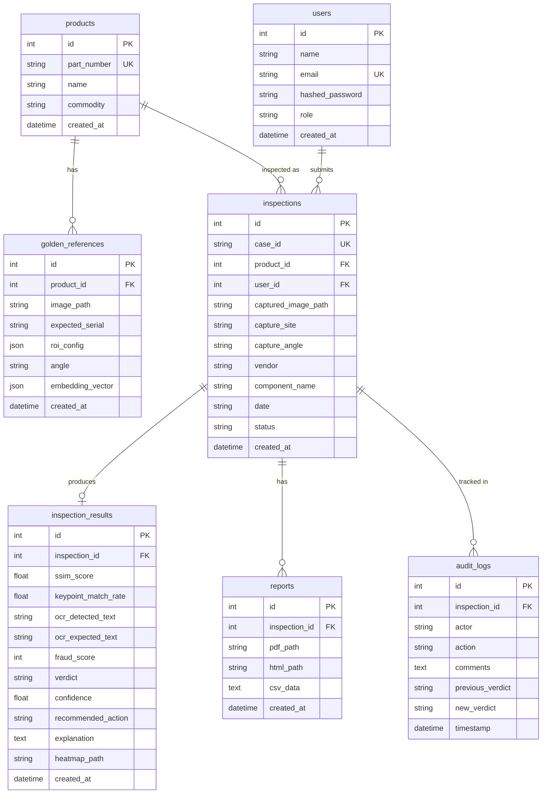

<p align="center">
  
  
  
</p>

<h1 align="center">🔍 VeriVision AI</h1>
<h3 align="center">
  <em>Parts Fraud Detection using Computer Vision & Agentic AI</em>
</h3>

<p align="center">
  
  
  
  
  
  
  
  
</p>

---

## 👥 Team IDEAFORG-E

| Name | Role |
|:---|:---|
| **Disha** | Team Member |
| **Anil** | Team Member |
| **Priyanka** | Team Member |
| **Chaitanya** | Team Member |
| **Jagruti** | Team Member |

---

## 📖 The Problem — A Story That Costs Billions

> *Imagine a Tuesday morning at a global electronics repair hub. A pallet of 500 replacement motherboards arrives from a third-party vendor. They look perfect. The serial stickers are crisp. The packaging is intact. A technician picks one up, installs it in a customer laptop, and ships it out. Two weeks later, the customer calls — the board is dead. It was a counterfeit. One board out of 500. But finding it manually? That would have taken a human inspector 4 hours with a magnifying glass, comparing each board against a reference photo, squinting at serial numbers, checking if a "0" was swapped for an "O".*

> *Now multiply that across 15 repair sites, 50 vendors, and 10,000 parts per month.*

This is not a hypothetical. **This is the reality of global repair and manufacturing supply chains today.**

### The Numbers That Keep Supply Chain Leaders Awake

| Statistic | Scale |
|:---|:---|
| Global counterfeit trade | **$467 billion** annually (2.3% of global imports) — OECD |
| Electronics sector losses | **$100+ billion** per year |
| Companies hit by supply chain fraud | **47%** in the last 2 years |
| Defense sector counterfeit infiltration | Up to **15%** of components |
| Fraud Detection & Prevention market | **$54.6 billion** (2025) and growing |

The fraud is sophisticated. Tampered parts with broken QC seals. Labels where a warranty code has one character altered — `A00-00` becomes `A00-0O`. Boards returned as "new" that carry microscopic solder residue from previous use. Non-OEM stickers with slightly different hues that pass a casual glance but fail under pixel-level analysis.

**Manual inspection can't scale. It can't be consistent across sites. It can't catch a single altered character in a serial number at 3 AM on a night shift.**

The industry needs an AI system that can see what humans miss — automatically, consistently, and with audit-ready evidence.

---

## 💡 Our Solution — VeriVision AI

**VeriVision AI** is an end-to-end **Agentic AI platform** that replaces manual visual inspection with a deterministic, explainable, **5-agent computer vision pipeline** built on **LangGraph**. 

Upload an image of a part. The system automatically:
1. **Finds** the matching golden reference from a visual embedding library
2. **Validates** image quality (blur, lighting, alignment)  
3. **Inspects** for anomalies using 6 parallel detection methods
4. **Judges** the evidence with a weighted scoring matrix
5. **Explains** the verdict in natural language for audit compliance

No manual pairing. No subjective judgment. No inconsistency between sites.

### What Makes VeriVision Different

| Dimension | Traditional QC | VeriVision AI |
|:---|:---|:---|
| **Speed** | 4+ hours per pallet | Seconds per part |
| **Consistency** | Varies by inspector, shift, fatigue | Deterministic — same input, same verdict |
| **Evidence** | Handwritten notes, verbal reports | Heatmaps, OCR diffs, PDF audit trail |
| **Scalability** | 1 inspector per station | Unlimited concurrent inspections |
| **Learning** | Tribal knowledge, no feedback loop | HITL feedback refines thresholds over time |
| **Fraud Types** | Catches obvious tampering | Catches 0→O character swaps, hue shifts, missing stickers, component swaps |

---

## 🏗️ High-Level System Architecture

The following diagram illustrates the high-level architecture of **VeriVision AI**, highlighting the flow of data from the User Interface down to the 5-Agent LangGraph State Machine, Parallel Detection Ensemble, and Persistence Layer:

```mermaid
flowchart TB
    subgraph FRONTEND ["💻 Frontend Client Layer (React 18 + Vite SPA)"]
        UI["Operator & Admin Workspaces\n(Triage Queue, Split-Panel Audit Workbench, Analytics Dashboard, ROI Editor)"]
    end

    subgraph GATEWAY ["⚡ Backend API Gateway (FastAPI)"]
        API["REST API Router Services\n(Auth, Inspections, Triage Queue, Reviews, Reports, Analytics)"]
    end

    subgraph PIPELINE ["🤖 5-Agent LangGraph AI Engine (workflow.py)"]
        A1["Agent 1: Selector & Gatekeeper\n(CLIP 512-Dim Vector Search)"]
        A2["Agent 2: Ingest & Triage Aligner\n(Blur, Brightness & ORB Homography)"]
        A3["Agent 3: Vision-AI Hybrid Inspector\n(Parallel Anomaly Ensemble)"]
        A4["Agent 4: Decision Judge\n(Weighted Risk Matrix & Multi-Angle Fusion)"]
        A5["Agent 5: Audit Explainer\n(LLM Rationale & PDF Generator)"]

        A1 -->|Pass Viability| A2
        A2 -->|Pass Quality| A3
        A2 -.->|Quality Fail| RET["⚠️ Retake Requested"]
        A3 --> A4
        A4 --> A5
    end

    subgraph DETECTORS ["⚡ Agent 3: Parallel Computer Vision & LLM Suite"]
        SSIM["1. SSIM Structural Diff\n(skimage metrics)"]
        OCR["2. EasyOCR String Diff\n(Levenshtein Distance)"]
        ORB["3. ORB Keypoint Rate\n(BFMatcher KNN)"]
        TMPL["4. Template ROI Check\n(cv2.matchTemplate)"]
        COLOR["5. 3D Color Histogram\n(RGB Correlation)"]
        VLLM["6. Multimodal Vision LLM\n(OpenRouter API)"]
    end

    subgraph STORAGE ["🗄️ Persistence & Media Storage Layer"]
        DB[(SQLite verivision.db\nUsers | Products | GoldenRefs |\nInspections | Results | Reports | AuditLogs)]
        FS["File System Store\ndata/cases/ | data/golden/ | data/reports/"]
    end

    subgraph HITL ["🧠 Human-in-the-Loop Feedback Loop"]
        REVIEW["Human Review Workbench\n(Approve / Reject / Override Verdicts)"]
        CALIB["Threshold Calibration & Audit Trail Log"]
    end

    %% Data Flow Connections
    UI -->|HTTP / REST API Calls| API
    API -->|Invokes State Graph| A1
    A3 -->|ThreadPool Parallel Execution| SSIM & OCR & ORB & TMPL & COLOR & VLLM
    A5 -->|Saves Inspection Results| DB
    A5 -->|Saves Heatmaps & PDF Reports| FS
    UI -->|Inspector Sign-off| REVIEW
    REVIEW -->|Logs Audit Entry & Updates Risk| DB
    REVIEW -->|Tunes Config & ROIs| CALIB
    CALIB -->|Refines System Thresholds| API
```

---

## 🛠️ Complete Technology Stack

| Layer / Category | Technology | Version / Spec | Purpose & Role |
|:---|:---|:---|:---|
| **Frontend Framework** | React 18 | `18.3.1` | Modern component-based Single Page Application (SPA) |
| **Frontend Build Tool** | Vite | `5.2.0` | Lightning-fast development server with Hot Module Replacement (HMR) |
| **Styling & Theme** | Tailwind CSS | `3.4.3` | Utility-first styling with custom dark/light mode theme tokens |
| **UI Components & Icons** | Lucide React | `0.344.0` | Industrial QA icon set for audit status & navigation |
| **Data Visualization** | Recharts | `3.9.2` | Interactive charts for vendor risk, site breakdown, and monthly fraud trends |
| **Routing & Protection** | React Router | `6.22.3` | Declarative client-side routing with role-based `ProtectedRoute` guards |
| **Backend API Gateway** | FastAPI | `0.100.0+` | High-performance asynchronous REST API framework |
| **Server ASGI** | Uvicorn | `0.22.0+` | ASGI web server running the backend API endpoints |
| **Agentic Workflow** | LangGraph | `0.0.1+` | Directed acyclic graph orchestrating the 5 autonomous AI agents |
| **Deep Learning & Neural Vector** | PyTorch & Open_CLIP | `torch 2.0+`, `ViT-B/32` | Extracts 512-dimensional visual embeddings for sub-10ms similarity matching |
| **Computer Vision Engine** | OpenCV | `4.7.0+` | Homography image registration, Laplacian blur check, and heatmap overlays |
| **Structural Metrics** | scikit-image | `0.20.0+` | Structural Similarity Index (SSIM) pixel delta matrix calculation |
| **Text Extraction (OCR)** | EasyOCR | `1.7.0+` | Optical Character Recognition for serial numbers & character diffs |
| **Multimodal Vision & LLM** | OpenRouter API | REST Endpoint | Multimodal visual comparison & audit-ready natural language explanations |
| **PDF Report Generator** | ReportLab | `4.0.0+` | Generates laboratory compliance PDF certificates with embedded heatmaps |
| **Database Engine** | SQLite | SQLite 3 | Embedded relational database storing cases, products, and audit trails |
| **Database ORM** | SQLAlchemy | `2.0.0+` | Python ORM with 7 relational tables and session management |
| **Security & Auth** | Passlib & PyJWT | `python-jose 3.3+` | JWT token authentication with bcrypt password encryption |

---

## 🤖 Detailed Breakdown of the 5 LangGraph Agents

VeriVision's core is a **LangGraph StateGraph** — a directed acyclic graph where each node is a specialized AI agent. The graph supports conditional routing: if triage fails, the pipeline short-circuits to request a retake instead of producing a false verdict.

#### Agent 1 — Selector & Gatekeeper (`agent_1_selector.py`)
- **CLIP ViT-B/32 Embedding Engine**: Extracts 512-dimensional visual feature vectors from uploaded images
- **Cosine Similarity Search**: Matches the upload against the entire Golden Reference library in <10ms
- **Multimodal Commodity Classifier**: Uses OpenRouter vision models to auto-classify parts (motherboard, RAM, SSD, label, etc.)
- **Viability Gate**: Validates aspect ratio alignment, resolution scale, and visual layout agreement before proceeding

#### Agent 2 — Triage & Aligner (`agent_2_triage.py`)
- **Blur Detection**: Laplacian variance analysis with configurable threshold
- **Lighting Validation**: Mean pixel intensity range checks (too dark / too bright)
- **ORB Keypoint Alignment**: 2000-feature ORB descriptor extraction → BFMatcher → RANSAC homography registration
- **Illumination Normalization**: Adaptive histogram equalization applied only when alignment is geometrically reliable (≥15% RANSAC inlier ratio)

#### Agent 3 — Vision-AI Hybrid Inspector (`agent_3_detector.py`)
Runs **6 detection methods in parallel** using `ThreadPoolExecutor`:

| # | Method | What It Catches | Key Output |
|:--|:---|:---|:---|
| 1 | **SSIM Structural Diff** | Missing components, physical damage, PCB layout changes | `ssim_score` (0.0 - 1.0) & JET Heatmap |
| 2 | **EasyOCR + String Diff** | Altered serial numbers (0→O, I→1, S→5), missing labels | `ocr_similarity` & `ocr_mismatches` array |
| 3 | **ORB Keypoint Rate** | Component swaps, assembly variations | `keypoint_ratio` score |
| 4 | **Template/ROI Presence** | Missing QC stickers, warranty seals, logos | `template_match_score` & flag |
| 5 | **3D Color Histogram** | Non-OEM labels, different paint/material hue | `color_hist_similarity` score |
| 6 | **Multimodal Vision LLM** | Semantic anomalies (burns, cracks, residue, rotation) | `multimodal_report` narrative text |

Also generates:
- **SSIM Anomaly Heatmap**: Real image with red bounding box overlays on high-delta regions
- **Diagnostic Card**: Side-by-side Golden vs Target vs Heatmap composite image

#### Agent 4 — Decision Judge (`agent_4_decision.py`)
- **Weighted Scoring Matrix**: SSIM (35%) + OCR (20%) + Vector Embedding (15%) + Keypoints (15%) + Template (10%) + Color (5%)
- **Fraud Score**: 0–100 scale with amplification factor
- **5 Verdict Categories**: `Clean` | `Tampered` | `Missing` | `Mismatched` | `Reused`
- **4 Action Recommendations**: `Accept` | `Quarantine & Escalate` | `Request Vendor Verification` | `Request Additional Angle`
- **Leet-Speak Detection**: Recognizes minor character substitutions (0↔O, 1↔I, 5↔S) and downgrades severity
- **Borderline Handling**: Fraud scores 40–70 force confidence to 0.45 to trigger mandatory HITL review
- **Multimodal Fusion**: Vision LLM findings boost or confirm the mathematical verdict
- **Multi-Angle Fusion Engine** (Bonus): Noisy-OR probabilistic fusion across 2–3 camera angles

#### Agent 5 — LLM Explainer (`agent_5_explainer.py`)
- **Primary**: OpenRouter LLM generates fluent, audit-ready explanations grounded in Agent 4's reasoning
- **Fallback**: Rich rule-based template generator produces structured paragraphs covering SSIM, OCR, template, color, and verdict
- **Grounding Constraint**: The explainer cannot contradict the decision agent — it only narrates the pre-determined verdict

---

## 🧩 Full Feature Set

### Core Platform Capabilities

| Feature | Description |
|:---|:---|
| **🔬 AI Inspection Pipeline** | Upload a part image → automatic golden reference matching → 6-method anomaly detection → verdict + PDF report |
| **📊 Triage Queue** | Real-time case monitoring dashboard with filtering by status, verdict, site, and vendor |
| **🔍 Split-Panel Audit Workbench** | Side-by-side golden vs defective comparison with interactive SSIM heatmap overlays and OCR text diffs |
| **👤 Human-in-the-Loop Review** | Approve / Reject / Override verdicts with mandatory comments — all actions logged in audit trail |
| **⚙️ Admin Calibration Console** | Tune SSIM thresholds, keypoint delta, OCR fuzzy tolerance — changes apply to future inspections in real-time |
| **📈 Analytics Dashboard** | Vendor fraud rates, site breakdowns, monthly trend charts, repeat offender detection (Recharts) |
| **📄 PDF Audit Reports** | ReportLab-generated reports with metadata, verdict summary, side-by-side images, OCR character diffs, pipeline thresholds |
| **📥 CSV Bulk Export** | Case outcomes export: case_id, part_number, site, category, fraud_score, action |
| **🎨 ROI Region Editor** | Admin-configurable label, template, and color ROI regions per golden reference |
| **🧠 CLIP Reference Library** | 512-dim visual embedding index for fast golden reference auto-selection |
| **🌓 Dark/Light Mode** | Industrial QA-optimized dual theme UI |
| **🔐 JWT Authentication** | Role-based access control (Admin / Operator) with secure token management |

### Bonus Challenges Implemented

| Bonus Challenge | Status | Implementation |
|:---|:---|:---|
| **Multi-Angle Fusion** | ✅ Complete | Noisy-OR probabilistic fusion across 2–3 angles with agreement confidence multiplier |
| **Self-Serve ROI Editor** | ✅ Complete | Admin can configure label, template, and color ROI coordinates per golden reference |
| **Reference Library with Embeddings** | ✅ Complete | CLIP ViT-B/32 vectors indexed in SQLite; cosine similarity retrieval |
| **Analytics Dashboard** | ✅ Complete | Vendor risk, site breakdown, monthly trends, repeat offenders — live data (not mock) |
| **Mobile-Readiness Design** | ✅ Documented | REST API contracts designed for future mobile capture integration |

---

## 🗄️ Data Model



---

## 📂 Repository Structure

```
VeriVision-AI/
│
├── backend/                            ← Python FastAPI application
│   ├── app/
│   │   ├── agents/
│   │   │   └── workflow.py             ← LangGraph 5-agent state machine
│   │   ├── routers/
│   │   │   ├── analytics.py            ← Vendor/site/monthly analytics endpoints
│   │   │   ├── auth.py                 ← Login, register, /me endpoints
│   │   │   ├── inspections.py          ← Case submission, listing, deletion
│   │   │   ├── products.py             ← Golden Reference catalog CRUD
│   │   │   ├── reports.py              ← PDF export, CSV bulk export
│   │   │   ├── reviews.py              ← HITL review actions + pending queue
│   │   │   └── triage.py               ← Case queue, pipeline config, ROI updates
│   │   ├── services/
│   │   │   ├── agent_1_selector.py     ← CLIP vector search + commodity classifier
│   │   │   ├── agent_2_triage.py       ← Blur/brightness checks + ORB alignment
│   │   │   ├── agent_3_detector.py     ← SSIM diff, OCR parsing, keypoint/color analysis
│   │   │   ├── agent_4_decision.py     ← Weighted rule-based scoring matrix
│   │   │   ├── agent_5_explainer.py    ← LLM + rule-based natural language generator
│   │   │   ├── embedding_service.py    ← CLIP vector extraction + cosine similarity search
│   │   │   └── reporting.py            ← PDF + CSV report generators
│   │   ├── config.py                   ← Settings class (env vars + defaults)
│   │   ├── database.py                 ← SQLite engine + session factory
│   │   ├── main.py                     ← FastAPI app entry point + router registration
│   │   ├── models.py                   ← SQLAlchemy table definitions (7 tables)
│   │   ├── schemas.py                  ← Pydantic request/response schemas
│   │   └── utils.py                    ← JWT auth helpers, image loader
│   ├── data/
│   │   ├── cases/                      ← Uploaded inspection scan images + heatmaps
│   │   ├── golden/                     ← Golden reference images
│   │   └── reports/                    ← Generated PDF reports
│   ├── .env.example                    ← Template for .env setup
│   ├── requirements.txt                ← All Python dependencies
│   └── seed_db.py                      ← DB migration + default user/catalog seeder
│
├── frontend/                           ← React Vite SPA
│   ├── src/
│   │   ├── components/
│   │   │   ├── Auth.jsx                ← Login form component
│   │   │   ├── Case.jsx                ← Case card and detail components
│   │   │   ├── Common.jsx              ← Shared UI: badge, spinner, modal
│   │   │   ├── Feedback.jsx            ← Toast notifications and alerts
│   │   │   ├── Layout.jsx              ← Sidebar navigation + top header
│   │   │   ├── Review.jsx              ← HITL review action panel
│   │   │   ├── TargetScanCaptureZone.jsx ← Image upload drag-and-drop
│   │   │   ├── Triage.jsx              ← Triage queue table rows
│   │   │   └── UploadInspectionModal.jsx ← New inspection submission modal
│   │   ├── context/
│   │   │   └── AuthContext.jsx         ← JWT session provider (login/logout state)
│   │   ├── pages/
│   │   │   ├── AIInspectionPage.jsx    ← Upload submission page
│   │   │   ├── AdminConsolePage.jsx    ← Admin calibration console
│   │   │   ├── AnalyticsDashboardPage.jsx ← Full analytics dashboard
│   │   │   ├── HumanReviewPage.jsx     ← HITL review workbench
│   │   │   ├── InspectionDetailPage.jsx ← Split-panel detail + heatmap workbench
│   │   │   └── LandingPage.jsx         ← Triage queue (main home page)
│   │   ├── routes/
│   │   │   └── AppRoutes.jsx           ← Route definitions + ProtectedRoute wrapper
│   │   ├── services/                   ← API service layer (fetch wrappers)
│   │   └── utils/                      ← Utility helpers
│   ├── package.json                    ← Frontend dependencies & scripts
│   ├── tailwind.config.js              ← Custom color palette + font configuration
│   └── vite.config.js                  ← Dev server proxy (port 5173 → 8000)
│
├── Golden_Images/                      ← Seed golden reference images (16 images)
├── AGENTS.md                           ← Deep dive 5-Agent & Workflow documentation
├── verivision.db                       ← SQLite database (auto-created)
├── start.bat                           ← One-click Windows launcher script
└── README.md                           ← Master system documentation
```

---

## ⚡ Quick Start

### Option A: One-Click Launch (Windows)

```cmd
start.bat
```

This script automatically:
- Checks for Python venv and Node modules
- Kills conflicting processes on ports 8000/5173
- Seeds the database with default accounts and golden reference catalog
- Launches backend (FastAPI on port 8000) and frontend (Vite on port 5173)
- Opens Chrome to `http://localhost:5173`

### Option B: Manual Setup

#### 1. Backend
```bash
cd backend
python -m venv venv

# Windows:
venv\Scripts\activate
# Linux/macOS:
# source venv/bin/activate

pip install -r requirements.txt
python seed_db.py
uvicorn app.main:app --reload --port 8000
```

#### 2. Frontend
```bash
cd frontend
npm install
npm run dev
```

#### 3. Environment Variables (Optional)
Copy `backend/.env.example` to `backend/.env` and configure:
```env
SECRET_KEY=your_jwt_secret_key
OPENROUTER_API_KEY=your_openrouter_api_key    # Enables multimodal vision + LLM explanations
OPENROUTER_MODEL=nvidia/nemotron-3-ultra-550b-a55b:free
DATABASE_URL=sqlite:///./verivision.db
```

> **Note**: VeriVision works fully without an OpenRouter API key. The multimodal vision comparisons and LLM explanations gracefully fall back to local rule-based alternatives.

---

## 🔑 Demo Credentials

| Role | Email | Password | Access |
|:---|:---|:---|:---|
| **Admin** | `admin@verivision.com` | `admin123` | Full access: Triage, Catalog, HITL Review, Analytics, Config |
| **Operator** | `user@verivision.com` | `user123` | Triage Queue, Inspection Submission, Human Review |

---

## 🔄 How It Works — End-to-End Workflow

```
1. UPLOAD        → Operator uploads a part image via drag-and-drop
2. AUTO-MATCH    → CLIP embeddings auto-select the best golden reference
3. TRIAGE        → Image quality validated (blur, lighting, alignment)
4. INSPECT       → 6 detection methods run in parallel (~3-5 seconds)
5. DECIDE        → Weighted scoring matrix produces fraud_score + verdict
6. EXPLAIN       → LLM generates audit-ready natural language rationale
7. REPORT        → PDF report generated with heatmaps, OCR diffs, metadata
8. REVIEW        → HITL panel for Approve / Reject / Override with comments
9. AUDIT TRAIL   → Every action logged: who, when, what changed, why
10. ANALYTICS    → Dashboard updates: vendor risk, site trends, monthly fraud rates
```

---

## 🎯 Test Scenarios Supported

| # | Scenario | Detection Method | Category | Expected Action |
|:--|:---|:---|:---|:---|
| 1 | Missing QC label | Template ROI + SSIM delta | Missing | Quarantine & Escalate |
| 2 | Altered serial number (0→O) | OCR + Levenshtein diff | Mismatched | Escalate with evidence |
| 3 | Reused board with residue | SSIM + keypoint anomaly | Reused / Tampered | Request additional angle |
| 4 | False alarm (lighting) | Triage agent detects exposure issue | Clean (after retake) | Triage requests retake |
| 5 | Non-OEM label (different hue) | Color histogram correlation | Mismatched | Vendor verification |
| 6 | Component swap | Keypoint mismatch spike | Tampered | Quarantine & Escalate |

---

## 🔮 Extensibility Roadmap

VeriVision is architected for Phase I delivery with explicit design hooks for future expansion:

| Phase | Scope | Design Hooks in Current Codebase |
|:---|:---|:---|
| **Phase I** (Current) | Image Comparison Prototype + Reporting | Complete — 5-agent pipeline, PDF reports, CSV export, HITL feedback |
| **Phase II** | Analytics & APIs | REST API contracts already defined; analytics endpoints operational; vendor/site/monthly data live |
| **Phase III** | Mobile AI Capture | API accepts multipart image uploads; quality triage provides retake guidance; response schemas are mobile-friendly JSON |

---

## 🔒 Security & Privacy

- **JWT Authentication** with bcrypt password hashing and configurable token expiry
- **Role-Based Access Control**: Admin vs Operator permissions
- **Audit Trail**: Every verdict override, review action, and feedback is logged with actor, timestamp, previous/new state
- **Image Hash Provenance**: Case IDs and file hashes stored for traceability
- **Minimal Metadata Storage**: Only fields required for fraud decision and audit compliance
- **API-Ready for Cybersecurity Review**: Clean data contracts (Pydantic schemas) designed for future security hardening

---

## 📊 Judging Alignment

| # | Criterion | How VeriVision Addresses It |
|:--|:---|:---|
| 1 | Solution Quality | End-to-end pipeline: upload → detect → score → explain → report → review |
| 2 | Tool Stack Used | LangGraph, CLIP, PyTorch, OpenCV, EasyOCR, OpenRouter LLM, FastAPI, React, Recharts |
| 3 | Presentation & Pitch | Narrative README, live demo, architecture diagrams |
| 4 | Feasibility & Integration | REST API design, one-click launcher, configurable thresholds, SQLite portability |
| 5 | Innovation & Originality | 6-method parallel ensemble, Noisy-OR multi-angle fusion, CLIP auto-reference matching |
| 6 | Modularity & Reusability | Each agent is an independent service; LangGraph nodes are plug-and-play |
| 7 | Impact Potential | Addresses $100B+ electronics fraud problem; scales to any repair/logistics operation |
| 8 | Testing & Validation | 6 test scenarios covering all fraud categories including false-alarm handling |
| 9 | User Experience & Design | Dark/light mode, drag-and-drop upload, split-panel workbench, interactive analytics |
| 10 | Documentation Clarity | This README + `AGENTS.md` + inline code documentation + API docs at `/docs` |
| 11 | Security & Privacy | JWT auth, RBAC, audit logging, hash provenance, minimal data retention |
| 12 | Explainability & Transparency | Per-region heatmaps, OCR character diffs, LLM narratives grounded in measured metrics |
| 13 | Feedback Loop / Learning | HITL Approve/Reject/Override → audit logs → threshold tuning → improved future detections |

---

<p align="center">
  <strong>Built with ❤️ by Team IDEAFORG-E for the Dell FutureMind AI Hackathon Grand Final 2026</strong>
</p>
<p align="center">
  <em>Disha · Anil · Priyanka · Chaitanya · Jagruti</em>
</p>
