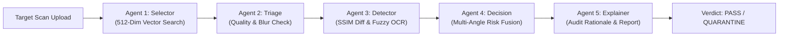

# VeriVision AI — Hardware RMA & Quality Audit Platform

> **Visual Hardware Verification & Multi-Agent Computer Vision Engine**  
> *Automated OEM reference matching, SSIM structural difference detection, fuzzy OCR serial verification, and Human-in-the-Loop compliance auditing.*

---

## 🌟 Executive Overview

**VeriVision AI** is an industrial-grade **Hardware RMA, Quality Assurance (QA), and Return Fraud Audit Platform**. Designed for electronics manufacturing, supply-chain logistics, and hardware distribution labs, VeriVision AI replaces manual visual inspection with a deterministic **5-Agent Computer Vision Pipeline**.

By cross-referencing incoming hardware components against catalog-validated **Golden Reference Models**, the platform detects component swaps, altered revision labels, counterfeit PCB modifications, missing capacitors, and physical tampering in under **10 milliseconds** vector retrieval time.

---

## 🔬 Core 5-Agent Computer Vision Pipeline



### 1. Agent 1 — Product Selector & Vector Indexer (`agent_1_selector.py`)
- Extracts **512-dimensional visual feature embeddings** using deep convolutional feature extractors.
- Performs sub-10ms **Cosine Similarity** vector matching against OEM Golden Reference catalogs.
- Auto-selects top candidate reference models when part numbers are obscured or missing.

### 2. Agent 2 — Ingest & Image Triage (`agent_2_triage.py`)
- Evaluates incoming scan quality prior to deep execution.
- Checks image blur (Laplacian variance), illumination uniformity, resolution limits, and perspective distortion.
- Prompts operators if a re-scan is required before pipeline ingestion.

### 3. Agent 3 — Structural Anomaly & OCR Detector (`agent_3_detector.py`)
- **RANSAC Homography Alignment**: Warps and aligns target images onto reference images regardless of rotation or angle.
- **SSIM Heatmap Generation**: Computes Structural Similarity Index (SSIM) matrix to highlight component anomalies (missing chips, burnt traces, counterfeit stickers).
- **EasyOCR & Fuzzy Parsing**: Extracts serial numbers, date codes, and revision tags. Uses **Levenshtein string distance** algorithms to detect tampered serial digits.

### 4. Agent 4 — Deterministic Risk & Decision Engine (`agent_4_decision.py`)
- Fuses structural anomaly scores, OCR character match metrics, and multi-angle camera perspectives (Top 0°, Angled 45°, Profile 90°).
- Evaluates weighted risk scores on a **0–100 Risk Scale**:
  - 🟢 **PASS** (`0 – 24 Risk`): Hardware matches OEM reference standard.
  - 🟡 **INVESTIGATE** (`25 – 49 Risk`): Minor label/serial discrepancies requiring QA review.
  - 🔴 **QUARANTINE** (`50 – 100 Risk`): High-confidence structural fraud or component swap detected.

### 5. Agent 5 — Audit Explainer & Report Engine (`agent_5_explainer.py`)
- Generates clear, human-readable audit summaries detailing exactly why a unit was flagged or approved.
- Feeds human reviewer canvas overrides back into the model tuning pipeline.
- Exports laboratory-grade PDF compliance certificates for vendor disputes.

---

## 🚀 Key Platform Features

- 📊 **Live Triage Queue**: Real-time monitoring table with instant filtering by risk tier (Pass, Investigate, Quarantine), vendor, and site location.
- 🔍 **Split-Panel Audit Workbench**: Side-by-side comparative inspection with interactive SSIM heatmap overlays, bounding box anomaly highlights, and OCR text diffs.
- 🎨 **Human-in-the-Loop (HITL) ROI Canvas**: Interactive ROI editor allowing QA inspectors to mark custom regions of interest, override automated verdicts, and submit training feedback.
- ⚙️ **Admin Calibration Console**: Catalog management portal for adding new Golden References, tuning risk weights, and updating vector embedding indices.
- 📈 **Analytics & Telemetry Dashboard**: Comprehensive Recharts visualization of fraud rates over time, vendor risk rankings, capture site anomaly breakdowns, and top failure reasons.
- 🌓 **Industrial QA Dark/Light Mode**: Dual-theme UI engineered for optical inspection environments.

---

## 🛠️ Architecture & Technology Stack

### Backend
- **Framework**: FastAPI (Python 3.10+) with Uvicorn ASGI server
- **Database**: SQLite with SQLAlchemy ORM (Pydantic schemas)
- **Computer Vision & AI**: PyTorch, OpenCV, EasyOCR, NumPy, SciPy (RANSAC Homography & SSIM)
- **Vector Search**: 512-Dimensional Cosine Similarity Embedding Engine

### Frontend
- **Framework**: React 18 with Vite build tool
- **Styling**: Tailwind CSS with custom CSS variables (`data-theme` synchronization)
- **Icons & Visualization**: Lucide React Icons, Recharts Analytics Charts
- **Routing & State**: React Router v6, React Context API (`AuthContext`)

---

## 📂 Repository Directory Structure

```text
VeriVision-AI/
├── backend/
│   ├── app/
│   │   ├── agents/
│   │   │   └── workflow.py             # 5-Agent orchestration engine
│   │   ├── routers/
│   │   │   ├── analytics.py            # Analytics & telemetry endpoints
│   │   │   ├── auth.py                 # User authentication & RBAC
│   │   │   ├── inspections.py          # Case inspection ingestion & list
│   │   │   ├── products.py             # Golden Reference catalog management
│   │   │   ├── reports.py              # PDF audit report generation
│   │   │   ├── reviews.py              # Human-in-the-loop QA overrides
│   │   │   └── triage.py               # Triage queue data & status updates
│   │   ├── services/
│   │   │   ├── agent_1_selector.py     # Embedding vector search
│   │   │   ├── agent_2_triage.py       # Quality & blur checking
│   │   │   ├── agent_3_detector.py     # SSIM heatmap & OCR parsing
│   │   │   ├── agent_4_decision.py     # Risk fusion & verdict decision
│   │   │   ├── agent_5_explainer.py    # Rationale generator & PDF reporting
│   │   │   └── embedding_service.py    # 512-dim visual vector extraction
│   │   ├── config.py                   # System environment settings
│   │   ├── database.py                 # SQLite database engine connection
│   │   ├── main.py                     # FastAPI application entry point
│   │   ├── models.py                   # SQLAlchemy database schemas
│   │   ├── schemas.py                  # Pydantic data validation schemas
│   │   └── utils.py                    # Image processing helper functions
│   ├── data/                           # Ingested inspection scans & heatmaps
│   ├── requirements.txt                # Python backend dependencies
│   └── seed_db.py                      # Initial database & catalog seeder
├── frontend/
│   ├── public/                         # Static assets & generated logo
│   ├── src/
│   │   ├── components/                 # Shared UI components (Layout, Auth, Modal)
│   │   ├── context/                    # AuthContext session provider
│   │   ├── pages/                      # Application route views (Triage, Detail, QA)
│   │   ├── routes/                     # AppRoutes & ProtectedRoute wrapper
│   │   └── services/                   # API service handlers (Axios / Fetch)
│   ├── index.html                      # Single Page Application root
│   ├── tailwind.config.js              # Tailwind custom color palette
│   └── vite.config.js                  # Vite server proxy configuration
├── Golden_Images/                      # OEM reference standard catalog images
├── start.bat                           # One-click Windows starter script
└── README.md                           # Master system documentation
```

---

## ⚡ Quick Start & Installation

### Option A: One-Click Launch (Windows)
Double-click `start.bat` in the root directory. It automatically initializes the Python virtual environment, installs backend/frontend dependencies, seeds the database, and launches both backend (port 8000) and frontend (port 5173).

```cmd
start.bat
```

---

### Option B: Manual Setup

#### 1. Backend Setup
```bash
cd backend
python -m venv venv
# On Windows:
venv\Scripts\activate
# On Linux/macOS:
# source venv/bin/activate

pip install -r requirements.txt
python seed_db.py
uvicorn app.main:app --reload --port 8000
```

#### 2. Frontend Setup
```bash
cd frontend
npm install
npm run dev
```

Open your browser and navigate to `http://localhost:5173`.

---

## 🔑 Demo Credentials

| Role | Email | Password | Access Rights |
| :--- | :--- | :--- | :--- |
| **Admin Inspector** | `admin@verivision.com` | `admin123` | Full access: Triage Queue, Catalog Calibration, HITL Review, Analytics |
| **Operator Inspector** | `user@verivision.com` | `user123` | Operator access: Triage Queue & Human QA Review |

---

## 📄 License & System Standards

Designed and built for precision technical hardware verification and supply chain compliance.  
© 2026 **VeriVision AI** — All Rights Reserved.
